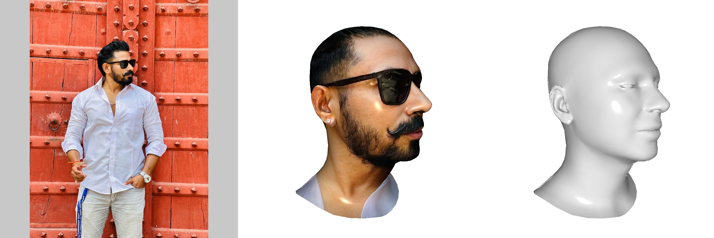
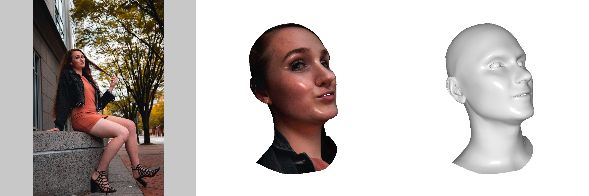
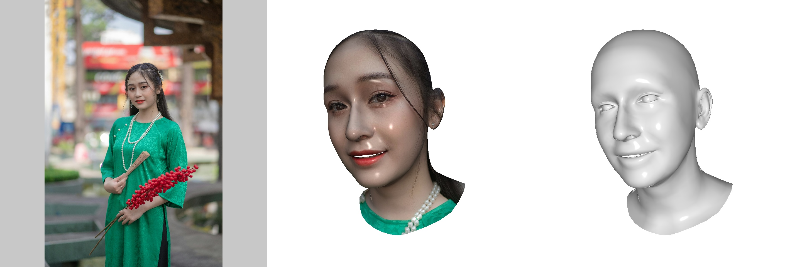
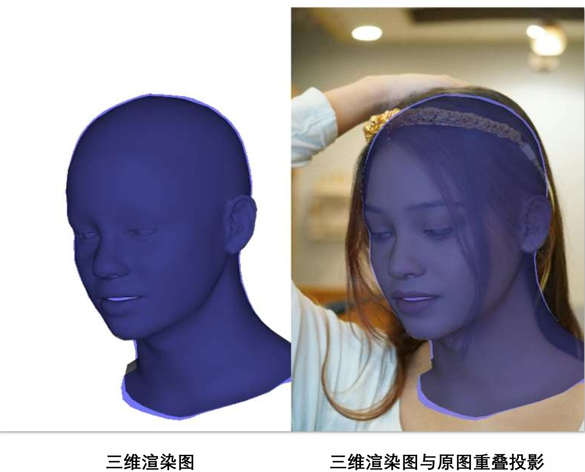
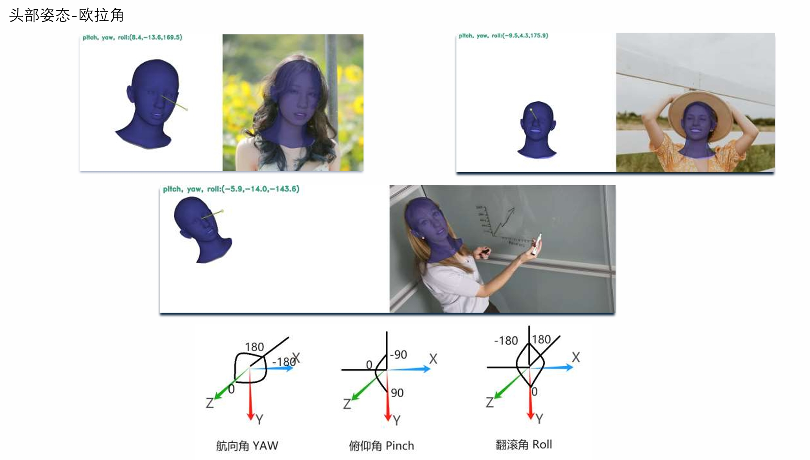
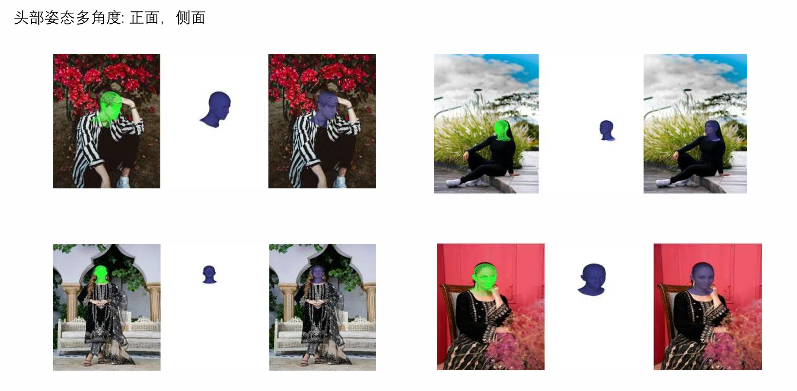
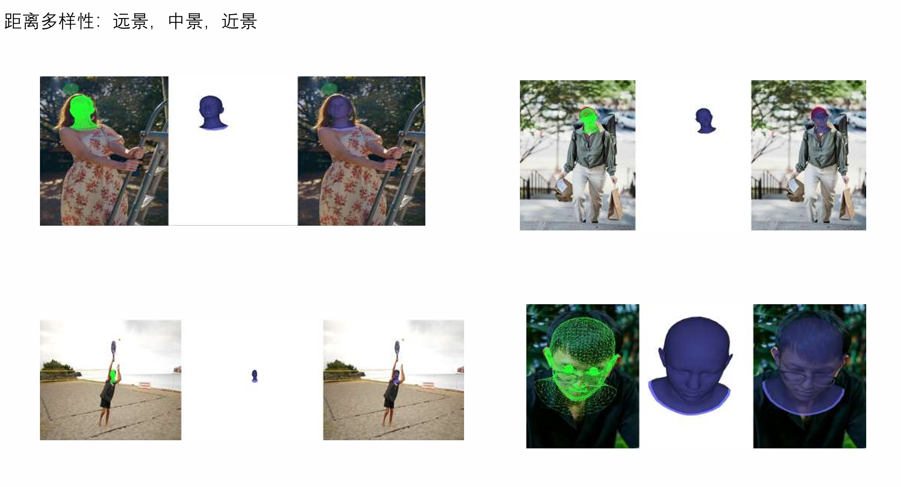

# Head3D X 2024
* 商用数据集
## 一、数据标注信息（数据量 20 w+）

* 1）高清原图（短边高于等于2000像素）
* 2）三维头部mesh（obj文件）
* 3）三维虚拟相机内参（npy文件）
* 4）二维头部关键点信息（npy文件
* 5）姿态角（pitch，roll，yaw）检测（基于相机坐标系）

* 三维维建模渲染示例：  
*     

*     

*   

*    

* 三维渲染图与二维图重投影
*    
* 二维关键点
*    

* 头部姿态-欧拉角
*    

## 二、数据特性
* 1）主体单人（占95%+）
* 2）头部多角度：正面，侧面
* 3）多人种：亚洲人，黑人，印度人，欧美人
* 4）性别：男，女
* 5）多年龄阶段：幼小，青年（数量最多），中年，老年
* 6）穿着多样性
* 7）距离多样性
* 8）环境多样性
* 9）光照多样性   

* 示例
* 头部姿态多样性
*   
* 距离多样性
*   

## 联系方式 （Contact）  
* E-mails: 305141918@qq.com   
* WeChat:
* 

<!--    -->
